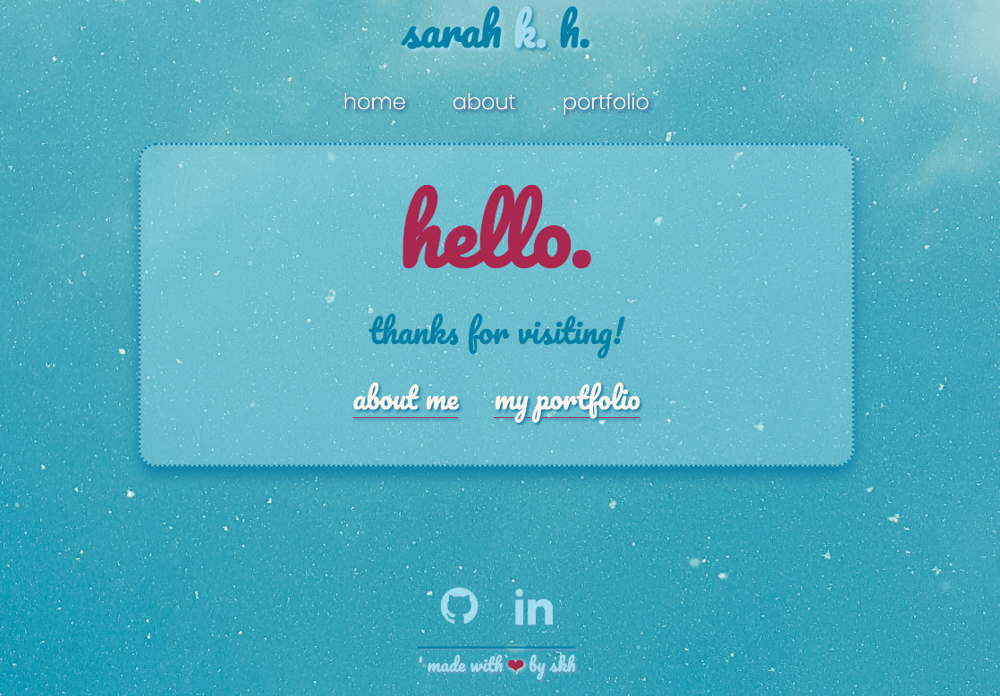

# React Portfolio (Challenge 20)

## About

This is a portfolio showcasing the group projects I contributed to while a student in the University of Oregon web development bootcamp in 2022-23. It's an updated React version of my first portfolio. 

While my original goal was to use TailwindCSS and DaisyUI, I was unable to get them to work as hoped and decided to adapt and add to the vanilla CSS from my original portfolio. The end result doesn't exactly match my original vision, but I enjoyed refreshing my vanilla CSS by experimenting with simple but fun animations and remembering how to implement an effective flexbox layout again without the help of a CSS framework. 

### Screenshots

## Installation & Use

Visit the Heroku deployment [here](https://starter-project.herokuapp.com/).

## Contributions

The following resources were used in the creation, troubleshooting, and deployment of this project:

* [Blog.Hubspot.com: How to Update Node Versions](https://blog.hubspot.com/website/update-node-js)
* [Chat GPT, for assistance with 'wiggle' CSS animation](https://chat.openai.com/)
* [CodeMyUI Gist on W3 svg icons and CSS styling](https://gist.github.com/CodeMyUI/0d52aa4075d25177df0281ac8a5e51f2)
* [DaisyUI](https://daisyui.com/)
* [Dev.to: Installing a New Node Version and Migrating npm Global Packages](https://dev.to/andy/installing-a-new-node-version-and-migrating-npm-global-packages-4no3)
* [FreeCodeCamp: How to Rename Git Branch](https://www.freecodecamp.org/news/git-rename-branch-how-to-change-a-local-branch-name/)
* [FreeCodeCamp forum post on react router difficulties](https://forum.freecodecamp.org/t/why-is-my-react-router-not-working/257114)
* [GitHub Markdown Guide](https://docs.github.com/en/get-started/writing-on-github/getting-started-with-writing-and-formatting-on-github/basic-writing-and-formatting-syntax)
* [Heroku Dev Center guide on deploying Node.js apps](https://devcenter.heroku.com/articles/deploying-nodejs)
* [Medium.com guide on deploying create-react-app on Heroku from GitHub](https://medium.com/make-it-heady/deploying-create-react-app-on-heroku-from-github-49447561f670)
* [React Router Docs](https://reactrouter.com/en/main/start/overview)
* [Stack Overflow TailwindCSS help](https://stackoverflow.com/questions/70577297/tailwind-class-is-not-working-after-installed)
* [Tailwind Docs](https://tailwindcss.com/docs/guides/create-react-app)
* [Yarnpkg.com installation guide](https://classic.yarnpkg.com/en/docs/install/#windows-stable)
